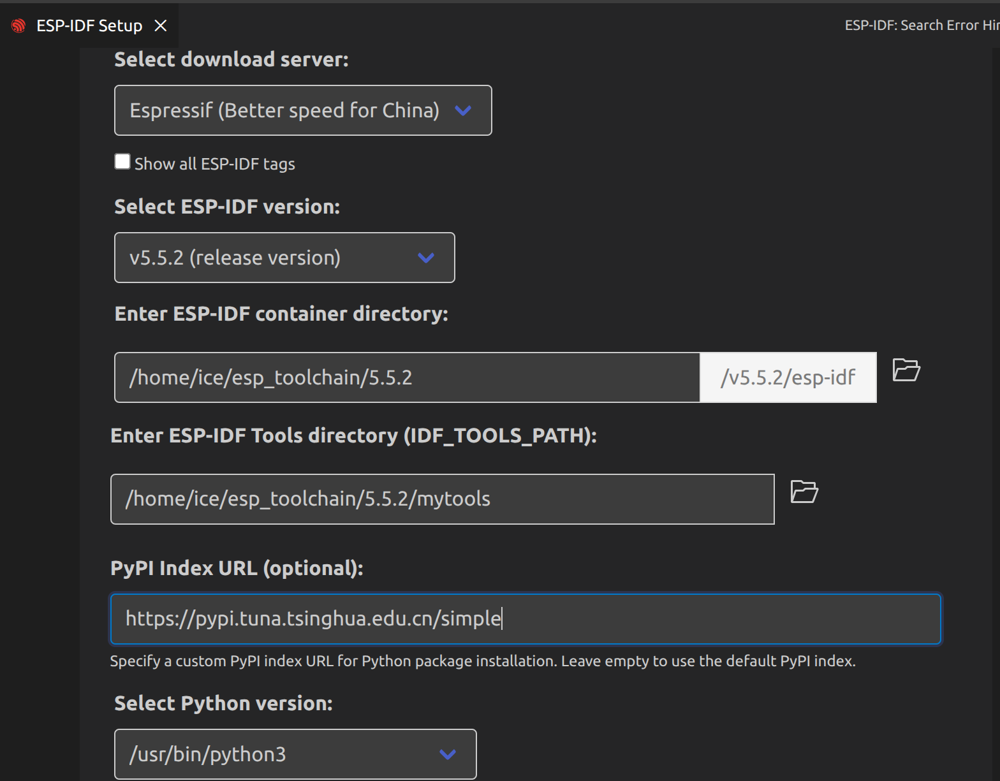

**本文介绍如何在vscode中配置esp-idf框架，并如何更好使用**

# 配置
首先你要先下载好vscode

+ 下载插件
```
c\c++

esp-idf（不要下载2.0.2版本，最好下载1的版本，要不然extention跳不出来）
```
+ 配置python环境

```
sudo apt update
sudo apt install python3.10-venv
```
+ 下载环境

ctrl + shift + p
输入
**ESP-IDF: Configure ESP-IDF extension**
打开，点击中间 **ADVANCED**



如果你有vpn,倒数第二个可以不填

等待安装完成，此后一直默认

如果安装出错也不要慌，把插件卸载，再把你刚刚填的文件夹路径给删了就行，重来一遍

# 配置好一个新工程