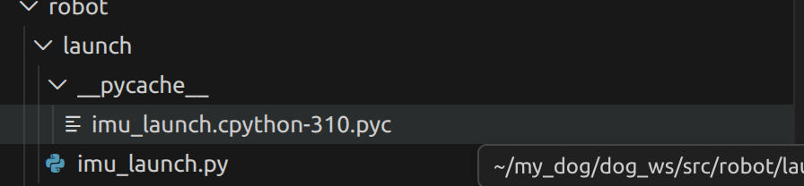

结构
launch
    -imu_launch.py
    -pycache

imu_launch.py 的作用是启动 IMU 相关的 ROS 2 节点，负责从 IMU 传感器获取数据并发布到 ROS 2 的话题上。这个文件通常包含了节点的创建、参数设置以及数据发布的逻辑。

启动 IMU 驱动节点：让系统开始读取惯性测量单元（惯性传感器，检测姿态、加速度等）的数据。

配置参数：告诉程序传感器连接在哪个端口（比如 /dev/ttyUSB0）、波特率是多少、坐标系名称是什么。

节点协同：如果 IMU 数据需要经过一个滤波器（比如 madgwick_filter），Launch 文件可以同时把驱动程序和滤波器一起运行起来

pycache这个文件夹
这是 Python 自动生成的。当你运行这个脚本时，Python 会把它编译成字节码（即里面的 .pyc 文件），以便下次运行得更快。你不需要去修改这个文件夹里的任何内容，也不用担心它。如果你想清理一下，可以删除 pycache 文件夹，Python 会在下次运行时重新生成它。总之，这个文件夹就是 Python 的“编译缓存”，对你的代码运行没有任何影响。