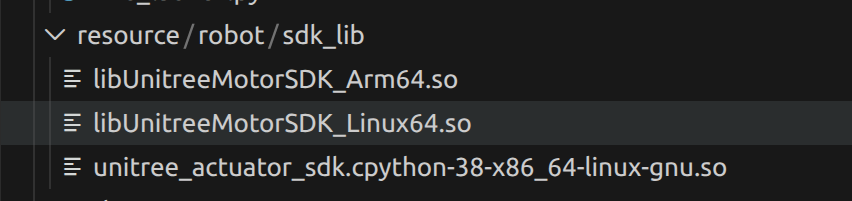

有三个.so文件

+ libUnitreeMotorSDK_Arm64.so
架构： ARM 64位架构。
使用场景： 当你把开发好的代码最终部署到真实的机器人本体内部（比如机器狗背上常见的 Jetson Nano、树莓派等嵌入式主控板，它们通常是 ARM 架构）时，系统就会需要这个库来驱动电机。


+ libUnitreeMotorSDK_Linux64.so
架构： x86_64 架构。

使用场景： 这是给传统的电脑 CPU 用的。当你在你的 ThinkPad 笔记本上做开发、跑仿真，或者用网线连着电机进行初步调试时，底层代码就会自动链接这个库.


+ unitree_actuator_sdk.cpython-38-x86_64-linux-gnu.so

因为底层的电机控制对实时性要求极高，所以宇树官方是用 C/C++ 写的。但是 ROS 2 开发者往往喜欢用 Python 写上层逻辑。这个 .so 文件其实就是一个包装盒，它把底层的 C++ 函数暴露出 Python 接口，让你可以在 VSCode 里直接通过 import unitree_actuator_sdk 来调动 C++ 写的底层硬件控制代码

给你的应用代码雇佣了一个专业的**硬件通信外包团队**。
你的上层业务代码（比如前面提到的 unitree_go_1.py）只需要像老板一样下达高级指令——“让 1 号电机输出 2 牛米的扭矩”——至于如何把这个指令翻译成电机能听懂的二进制数据帧、如何处理底层的 CAN/串口通信协议、如何进行奇偶校验，这些脏活累活，全部由这三个 SDK 动态链接库（.so 文件）在底层帮你默默搞定


# 如何用python代码调用这个SDK

此示例为gemini生成
```python
import time
import sys

# 【第一步：引入外包团队】
# 这里导入的就是图里那个 unitree_actuator_sdk.cpython-38-x86_64-linux-gnu.so
# 前提：该 .so 文件必须在当前脚本目录下，或者被正确添加到了系统的 PYTHONPATH 中
import unitree_actuator_sdk as unitree

def main():
    # 【第二步：铺设专属通信专线】
    # 告诉 SDK 你的硬件是怎么连到电脑上的。
    # 在 Ubuntu 环境下，如果你用 USB 转串口模块连着电机，设备名通常是 /dev/ttyUSB0
    print("正在建立串口连接...")
    serial = unitree.SerialPort("/dev/ttyUSB0")
    
    # 【第三步：准备“快递包裹”和“回执单”】
    # MotorCmd 是你要发给电机的指令包
    # MotorData 是用来存放电机传回来的当前状态（比如实际位置、温度）
    cmd = unitree.MotorCmd()
    data = unitree.MotorData()

    # 【第四步：填写“快递单”（设置控制参数）】
    # 这就是你作为“老板”下达的高级指令，底层的协议打包 SDK 会帮你做
    cmd.motorType = unitree.MotorType.GO1  # 指定电机型号
    cmd.id = 0                             # 目标电机的 ID 号（一条总线上可以串联多个电机）
    cmd.mode = 10                          # 模式设定：10 通常代表闭环伺服控制模式

    # 设定电机的目标运动参数（运筹帷幄的核心逻辑）
    cmd.q = 3.14     # 目标位置 (Position) -> 比如让电机转到 3.14 弧度 (约半圈)
    cmd.dq = 0.0     # 目标速度 (Velocity) -> 0 表示到达位置后停住
    cmd.tau = 0.0    # 前馈扭矩 (Torque) -> 这里设为 0，完全靠位置闭环控制
    
    # 设定 PD 控制器的核心参数（体现控制理论的地方）
    cmd.Kp = 0.1     # 位置刚度系数 (Kp) -> 相当于一根弹簧，数值越大，电机到达目标位置的力度越猛
    cmd.Kd = 0.01    # 速度阻尼系数 (Kd) -> 相当于减震器，防止电机到达位置后反复震荡过冲

    print("开始发送控制指令，按 Ctrl+C 停止...")

    try:
        # 【第五步：高频收发，维持通信（流水线运转）】
        while True:
            # sendRecv 函数是 SDK 的核心魔法：
            # 它把 cmd 里的高级指令翻译成二进制串通过串口发出去，
            # 并立刻读取电机的硬件反馈，解包后存进 data 里。
            serial.sendRecv(cmd, data)

            # 打印电机当前反馈的真实数据 (查看回执单)
            # data.q 是真实位置，data.temp 是电机当前温度
            print(f"当前真实位置: {data.q:.2f} rad, 当前温度: {data.temp} °C")

            # 控制循环频率
            # 底层硬件控制通常需要极高的频率（比如 500Hz 也就是 0.002 秒一次），以保证平滑
            time.sleep(0.002)

    except KeyboardInterrupt:
        # 捕捉你在终端按 Ctrl+C 的中断信号
        print("停止控制，正在安全退出...")
        # 实际工程中这里通常要发一个让电机断电或归零的安全指令，防止失控

if __name__ == '__main__':
    main()

```