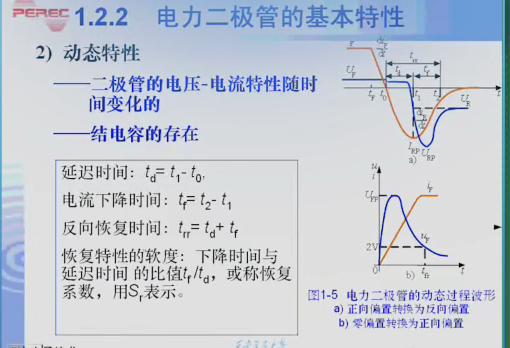

# 电力电子器件概述

## 电力电子器件的概念和特征
所谓电力电子器件就是功率半导体器件

工作模式的划分：

+ 整流 ： 用于让电路只往一个方向流动
+ 放大 ： 用于放大电子信号
+ 开关 ： 控制导通和关断

一般来说，电力电子器件工作在整流或者开关两种状态

因为处于放大状态，有放大的电流也有电压，会有功率损耗

而在开关状态，导通类似短路，关断类似开路

整流状态，同开关一样

这样使得u和i不同时有数值，即没有功率（理想情况下）

从以上工作模式的划分，我们可以知道，工作效率应该很高

但仍然耗散很大，举个例子，假设总功率为100KW，效率为99%，仍然有1KW的功耗，这对于人类来说仍然很大，所以说耗散功率大

## 电力电子器件的分类

+ 不可控器件
+ 半控型器件
+ 全控型器件

# 电力二极管

## 动态特性

静态特性明显就是PN结特性，没什么好说的

动态特性是因为结电容的存在，在外界电压改变的时候

总是会有正向偏置、反向偏置、零偏置，这三个状态的转换，我们称为过渡状态

过渡状态中，PN结的带电量总是会变化的，这种变化特性称为**动态特性**

而这种动态特性，一般专门用来指通态和断态

断态：电力二极管的电压由正向偏置到反向偏置
导通时，PN 结积累了大量的少数载流子。要关断，必须先把这些电荷抽走或复合掉。
在抽走这些电流的过程中形成了**反向电流**，这个电流比较大

紧接着，这些大量的少数载流子被消耗完，反向电流才开始下降，最终降至零（或微弱的漏电流）

通态：当二极管从断开状态突然进入导通状态时，也会有短暂的延迟。

现象：在导通瞬间，二极管两端的电压会先冲到一个比正常导通压降（如 0.7V-1.2V）高得多的峰值 $U_{FRM}$，然后才逐渐下降到稳态。

成因：主要是 PN 结的电导调制效应需要时间建立，以及引线电感的影响。

影响：在高频大电流下，正向恢复电压过高可能导致电路中其他元器件被击穿。

## 主要参数

我们需要考虑的参数有很多

比如正向压降Uf等

但是要考察的是有效电流和平均电流（额定电流）之间的考察

首先定义 波形系数为kf，额定电流为Iav，有效电流为Irms

则有 $K_f$ = $\frac{Iav}{Irms}$

有效值（RMS）与平均值（Average）的比值

这个的核心在于，理想情况下，Kf等于1 ，这个时候是每一分电流都在做功

可是实际上，必然有热效应，这个Kf就是在衡量，在都要做100w的功时，该波形总共会发热多少

**结论：$K_f$ 越大，说明波形越“尖锐”或越“稀疏”。这意味着为了获得相同的平均电流（做功），你必须承受更大的有效值电流（发热）。$K_f$ 越大，电力电子器件的利用率就越低**

真实总功率就是有效值电流做的功，也就是发热功；我们所需的是平均电流做的有用功

所以$K_f$肯定大于1

常用波形的波形系数

| 波形类型 | 波形系数 |
| --- | --- |
| 正弦全波 | 1.11 |
| 正弦半波 | 1.57 |
| 正弦1/4波 | 2.22 |
| 标准直流 | 1 |
| 半周期方波 | 1.414 |
| 1/4周期方波 | 2 |