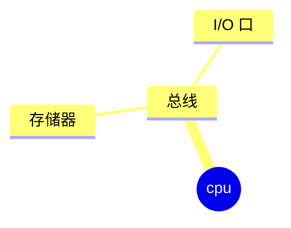
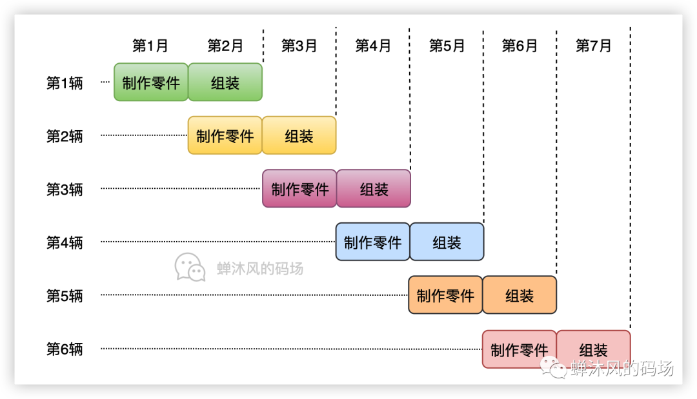
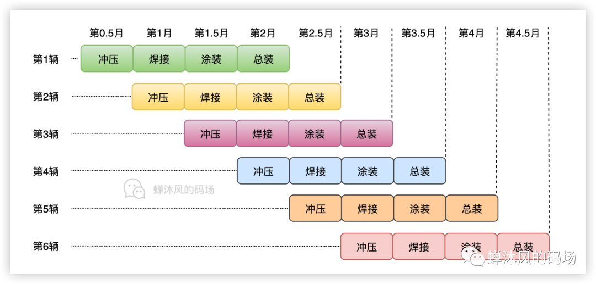
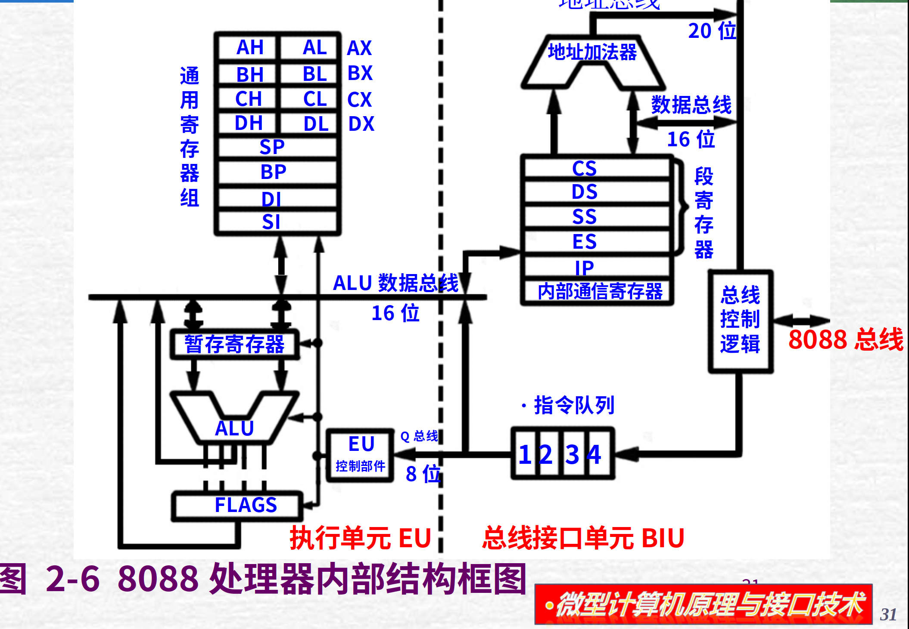

# cpu的探索

## cpu内部划分
微处理器一般由运算器、控制器和寄存器组三部分组成

运算器由ALU、通用寄存器、内部总线组成

它的作用是处理加减乘除和逻辑运算

它是无脑的，只是按部就班的执行操作

控制器是控制程序的执行，它是具有脑子的，从内存中获得代码，翻译并且给运算器执行

但这里有一个问题，这是不解耦的，控制器

## 指令流水线基础

CPU从外面看来是一个黑盒

它总是有规律地重复执行：
+ 从存储器中取出下一条指令
+ 指令驿码
+ 如果指令需要，从存储器中读取操作数
+ 执行指令（包括算术逻辑运算、I/O操作等）
+ 如果需要，将结果写入存储器

## 推导
我们不难看出，对于cpu，它的控制器从向地址总线上发送一个地址，从存储其中取出下一条指令

它把这个指令进行翻译

如果需要，它会从数据总线上把需要的数据拿过来，放入通用寄存器

最后它把数据或者指令全都丢给运算器这个黑盒

运算完成，控制器把数据结果通过数据总线写入存储器

运算器是一个“弱智”，此时控制器才是真正的大脑

## 引入并行执行（指令流水线）

对于cpu有规律地重复串行执行以上操作

有人想到了一种可以增大cpu工作效率的方法，我们先称之为并行（指令流水线）

如图所示，如果每次都从头干一轮，会非常浪费资源
那么应该怎样做才可以增加效率呢？如果一个人从头到尾就只做一件事的话，那么会更快

借鉴了流水线工程，cpu从最开始的控制器和运算器的划分走到了执行单元（Execution Unit）和总线接口单元（Bus Interface Unit）

执行单元相较于运算器，多了驿码功能，也就是从控制单元中抢走了驿码功能

总线接口单元的任务就很简单了，不妨把cpu模块化，给地址总线发送命令获取指令，有需要的话把数据也拿过来，之后通过内部的一个寄存器传递给执行单元，执行单元计算，计算完成给总线接口单元，再写入存储器

现在核心大脑在执行单元这里了，控制器简化为总线接口单元，变傻了，现在的任务就只是获取指令和数据

| 特性 | 控制器 | 运算器 |
| --- | --- | --- |
| 角色定位 | 决策与指挥中心 | 决策与指挥中心 |
| 核心任务 | 取指、译码、安排操作顺序、发出时序控制信号 | 算术运算（加减乘除）、逻辑运算（与或非）、移位操作 |
|主要组件|指令寄存器 (IR)、指令译码器 (ID)、程序计数器 |算术逻辑单元 (ALU)、累加器 (AC)、状态寄存器 (PSW)|
|形象比喻|乐队指挥|乐手|

|特性|EU (Execution Unit - 执行单元)|BIU (Bus Interface Unit - 总线接口单元)|
|---|---|---|
|核心定位|对内：负责指令的解析与执行|对外：负责与内存及 I/O 端口打交道|
主要职责|1. 从指令队列取指令2. 指令译码3. 执行运算4. 管理通用寄存器|1. 从内存取指令送入队列2. 计算 20 位物理地址3. 读写内存数据|
|包含组件|ALU (运算器)、通用寄存器、状态标志位、EU 控制电路。|段寄存器 (CS/DS/SS/ES)、指令指针 (IP)、地址加法器、指令队列|
|与总线关系|不直接接触外部总线，处于后端。|直接连接外部总线，控制地址、数据和控制线。|
|工作节奏|只要指令队列有东西，就一直工作。|只要指令队列没满，就一直去内存“抓”指令。|

按照最开始说的，假设串行指令所需的时间是3nt，那么并行指令执行只需要（n+2）t

## 寄存器

## cpu结构图推导

