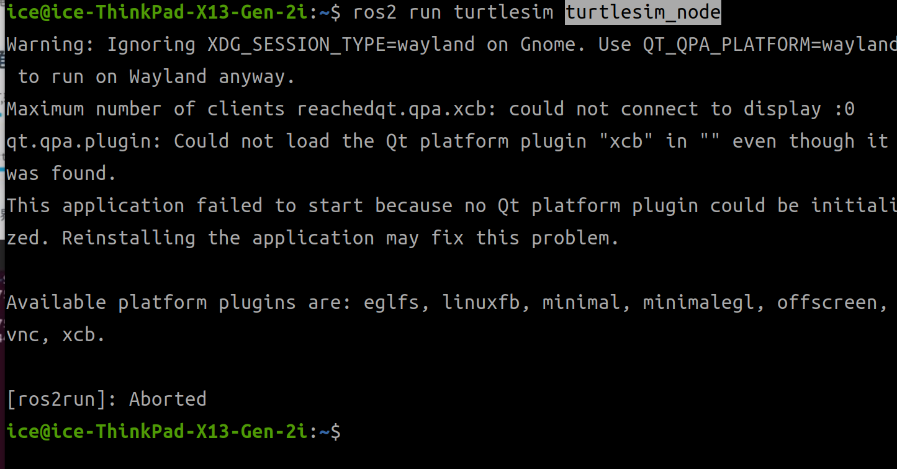

# ROS 2 GUI 程序（基于 Qt）与显示服务器（Wayland/X11）通信失败



在使用ROS 2 GUI程序（基于Qt）时，可能会遇到与显示服务器（Wayland/X11）通信失败的问题。这通常是由于环境变量配置不正确或权限问题引起的。

简单来说，turtlesim 想要打开一个窗口，但由于 Ubuntu 22.04 默认使用 Wayland 协议，而 Qt 默认尝试通过 XCB (X11) 连接显示器，中间出现了“拒之门外”的情况

解决方法：
既然报错提示你正在使用 Wayland，最直接的方法是告诉 Qt 同样使用 Wayland 协议。

```bash
vim ~/.bashrc
export QT_QPA_PLATFORM=wayland
source ~/.bashrc
```   


还是不行

```bug
qt.qpa.plugin: Could not find the Qt platform plugin "wayland" in ""
This application failed to start because no Qt platform plugin could be initialized. Reinstalling the application may fix this problem.
```


这个错误提示表明 Qt 无法找到 "wayland" 平台插件，可能是因为该插件未安装或环境变量配置不正确。

```bash
sudo apt install qtwayland5
``` 


安装完成后，重新运行 turtlesim 应该就能正常显示窗口了。

```bash
ros2 run turtlesim turtlesim_node

# 再创建一个终端
ros2 run turtlesim turtle_teleop_key
```
