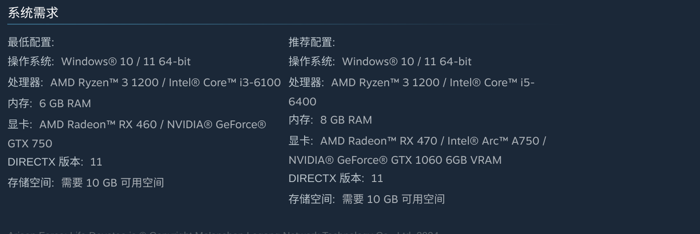

为了更好地了解电脑的性能，我们可以使用以下命令来查看电脑的显卡和CPU信息：
```bash
lspci | grep -i vga

# 00:02.0 VGA compatible controller: Intel Corporation TigerLake-LP GT2 [Iris Xe Graphics] (rev 01)
# 这个代表我的cpu是TigerLake：这是 Intel 第 11 代 处理器的代号。
# Iris Graphics：这就是你的显卡型号，全称是 Intel Iris Xe Graphics
# Iris Xe 显卡性能其实略强于游戏要求的最低配置 GTX 750


lscpu | grep "Model name"


free -h
#            total        used        free      shared  buff/cache   available
# 内存：       15Gi       7.2Gi       1.8Gi       2.5Gi       6.3Gi       5.3Gi
# 交换：      2.0Gi       1.4Gi       577Mi
# 主要关注available，它表示系统当前可用的内存量，通常比free更准确，因为它考虑了缓存和缓冲区的内存使用情况。
```
