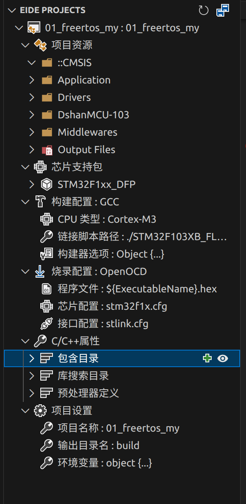

# 引言
在最开始学习的时候，使用windows上面的keil进行开发stm32,因为keil这个sdk集成的很成功，以至于我开发了一年，很多内置的配置一窍不通。
在我大二那年，我有了另一台电脑，我安装了ubuntu22.04，因为一无所知，我跟从大部分人的选择：拥抱cmake + openocd的交叉编译，成功了，我也就使用了这套开发方式

可是，keil毕竟陪伴了我这么久，同时以前实验室开发使用的是keil，我的一些教程代码，也是用的keil，如果就此抛弃，要重新写一些库的话，未免太过麻烦，同时linux不支持keil，除非下载一个wine配置一个windows环境，那我觉得没有必要

我知道eide这个跨平台方式可以解决，但是苦于之前一段时间高强度gaming，忘记了，于是今天打算来解决这个问题
在ubuntu上用vscode的插件eide进行类似windows上面的keil开发

# 安装各种软件
因为我是先进性cmake环境的搭建，再来搭建这个
其中有一些软件我可能已经下载过，我尽可能展现从零开始
若有一些忽略，也请谅解，求助ai

## 编辑器核心
+ vscode 这个不必多说
+ 三个插件：EIDE、C/C++、Cortex-Debug


## 编译工具链
gcc-arm-none-eabi：用于将 C/C++ 代码编译成 ARM 架构的二进制文件

```
\\安装命令：
sudo apt install gcc-arm-none-eabi
```

## 硬件调试与烧录工具
```
sudo apt install openocd

```

大致按照以上三个方向进行安装

# 配置环境



这里，我直接使用韦东山老师的项目

直接导入

图片显示的是最终可以进行编译烧录的工程

因为过程及其复杂，中间穿插一些解释

## 芯片支持包

包含了芯片的寄存器定义、启动文件（Startup）和官方库

这个必须要，必须去官网上面下载，这里尽可能精简，不提供下载办法，ai或者google

之后选择你的芯片

## 构建配置
编译器切换成GCC

如果没有，那就去**设置工具链** 里面配置，不过多赘述


## 链接器脚本
我不清楚为什么，明明我认为./STM32F103XB_FLASH.ld
应该是在01_freertos这个大项目的根目录中

我之前是放在根目录中，可是出现报错

于是我放在MDK-ARM中，就可以了


言归正传，因为编译器是根，链接器对应的枝，也会随着编译器的改变进行更换

在你下载的 STM32CubeF1 固件库 中，路径通常为：
Drivers/CMSIS/Device/ST/STM32F1xx/Source/Templates/gcc/linker/
找一个和你芯片型号对应的（例如 stm32f103xb_flash.ld，103C8T6 选 xb，103VET6 选 xe）

这个一定要替换，把arm的ld文件替换成gcc的ld文件


## 启动文件

把适合gcc的启动文件替换掉原本的文件即可

同时一定要更改eide.yml,这样才算修改了一整个工程

## 烧录方式
选择openocd

## C/C++属性之包含目录

在这里有一个坑，就是freertos也是会基于编译器进行区分的

也就是arm和gcc的portable中的文件是不一样的

首先先下载好gcc对应的port.c 和 portmacro.h

再进入目录，Middleware/FreeRTOS/Source/portable

portable/
├── MemMang/
├── RVDS/ 

你看见了这个

你需要创建一个GCC文件夹

根据你的芯片，你要在GCC下面创建ARM_CM3或者其他(注意是_,而不是-)

在ARM-CM3中放入port.c 和 portmacro.h

到了这个地步，终于可以在eide中配置了，找到包含目录，进行修改，把原本包含的RVDS替换成GCC

这只是配置了磁盘，并没有修改到工程

你还需要进入eide.yml中进行修改，修改同上一步

## FREERTOS问题
那么你还需要进行一些配置

问题根源是：port.c 和 portmacro.h 使用了 traceISR_ENTER、traceISR_EXIT_TO_SCHEDULER、traceISR_EXIT 这些宏，但 FreeRTOS.h 中没有默认定义它们。这是 FreeRTOS 版本不匹配导致的——portable 层代码较新，而核心库较旧


在 FreeRTOSConfig.h 中添加这些宏的空定义

在最后添加，规范化编程

```
/* Define trace macros that are used by newer FreeRTOS port files but not defined in older FreeRTOS.h */

#ifndef traceISR_ENTER
    #define traceISR_ENTER()
#endif

#ifndef traceISR_EXIT
    #define traceISR_EXIT()
#endif

#ifndef traceISR_EXIT_TO_SCHEDULER
    #define traceISR_EXIT_TO_SCHEDULER()
#endif

```